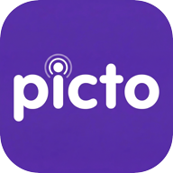

<p align="center">
  
</p>

<h1 align="center">PictoTap</h1>

<p align="center">
  Free and open-source communication app using pictograms.<br>
  Built with Flutter for web, installable as a PWA on any device.
</p>

<p align="center">
  <a href="https://endika.github.io/pictotap"><strong>Live Demo</strong></a> ·
  <a href="#why-pictotap">Why PictoTap?</a> ·
  <a href="#features">Features</a> ·
  <a href="#getting-started">Getting Started</a>
</p>

---

## About

PictoTap is a free, safe, and accessible communication app designed for people with Autism Spectrum Disorder (ASD). Its goal is to provide an easy way to communicate through pictograms on any device — mobile, tablet, or computer.

While originally designed for people with ASD, PictoTap can also be helpful for anyone with communication difficulties, including people with cerebral palsy or other conditions that affect speech.

## Why PictoTap?

Pictograms are universally easy to identify, making communication simple and intuitive.

- **Education** — A practical tool for teachers to communicate with students and support classroom routines, which are essential for people with ASD.
- **Social inclusion** — Helps people with communication difficulties participate more actively in everyday social interactions.
- **Family** — Enables fluid communication at home and helps families reinforce routines and learning from the classroom.

## Features

- **Pictogram keyboard** with categorized icons (descriptive, people, prepositions, determiners, nouns, verbs)
- **Visual board** to compose messages by selecting pictograms
- **Share** the board as a 1080×1080 image with text description
- **Installable PWA** — add to home screen on Android and iOS
- **Multi-language support**: English, Spanish, Catalan, Basque, French, Galician, Portuguese, Valencian
- **Accessibility-focused** design with semantic labels for screen readers

## Getting Started

### Prerequisites

- Flutter SDK >= 3.0.0

### Installation

```bash
flutter pub get
flutter gen-l10n
```

### Running

```bash
flutter run
```

### Testing

```bash
flutter test
```

## Project Structure

```
lib/
├── main.dart                     # App entry point
├── data/
│   └── pictogram_data.dart       # Pictogram categories and icon data
├── screens/
│   └── pictotap_screen.dart      # Main screen with board and state
├── services/
│   ├── image_saver.dart          # Platform export selector
│   ├── image_saver_native.dart   # Native image sharing (Android/iOS)
│   ├── image_saver_web.dart      # Web image download / Web Share API
│   └── image_saver_stub.dart     # Stub for unsupported platforms
├── utils/
│   └── pictogram_utils.dart      # Icon utility functions
├── widgets/
│   ├── board_empty_hint.dart     # Empty board hint animation
│   ├── pictogram_icon.dart       # Pictogram icon widget
│   └── pictogram_keyboard.dart   # Keyboard widget with categories
└── l10n/                         # Localization (ARB files)
```

## Team

This project was conceived and designed by **Leire Gerekaetxebarria** and **Irune Iglesias**, who envisioned a simple and effective communication tool for accessibility. Development by **Endika**.

## License

This project is licensed under [CC BY-NC-SA 4.0](https://creativecommons.org/licenses/by-nc-sa/4.0/) — free to use, modify and share, but **not for commercial purposes**.
